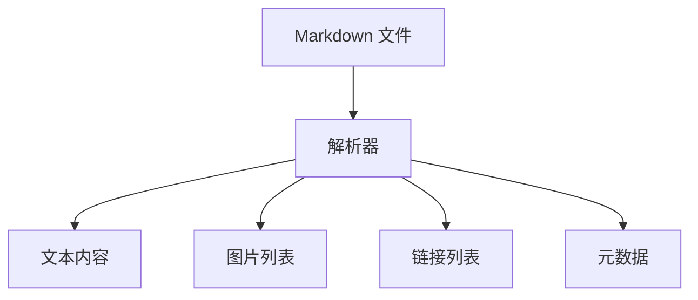
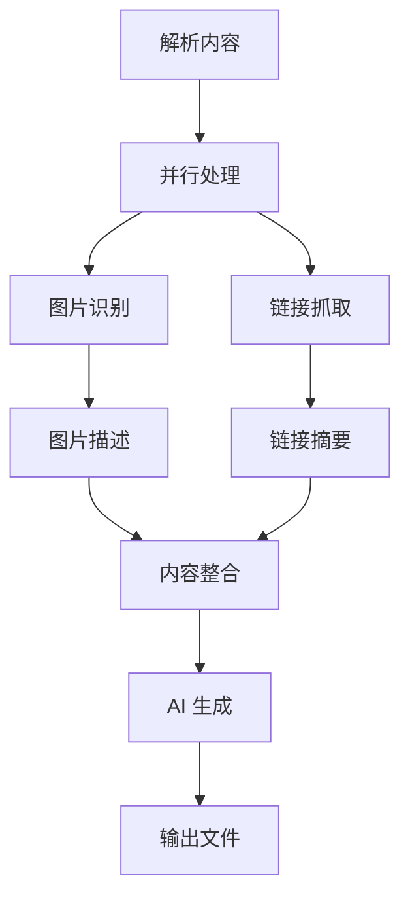
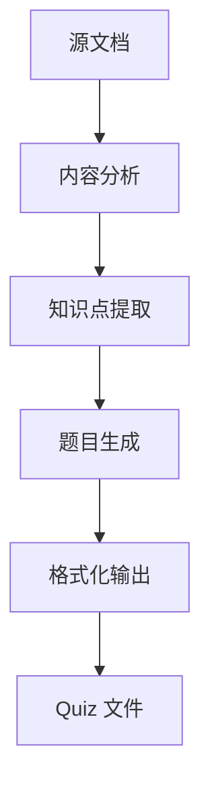

# 思序 (Notebook LLM) - AI 驱动的智能笔记学习系统

一个功能强大的 Obsidian 插件，集成多种 AI 模型，提供笔记智能整理、组合笔记管理、Quiz 生成与评分、学习数据可视化等完整的学习生态功能。

[](https://www.npmjs.com/package/obsidian-notebook-llm)
[](LICENSE)

## ✨ 核心功能

### 🧠 智能笔记整理
- **多模态处理**：同时理解文本、图片、链接内容
- **AI 重组**：基于多种模板智能重写和优化笔记
- **格式保持**：自动维护 Markdown 格式和 YAML 元数据
- **批量处理**：支持多个文件的后台并发处理

### 📚 组合笔记管理
- **拖拽添加**：直观的文件管理界面，支持拖拽排序
- **智能搜索**：全文搜索、文件夹筛选、日期范围、标签过滤
- **内容预览**：实时预览笔记内容的前50字符
- **一键整理**：将多个笔记合并为结构化的知识体系

### 🎯 Quiz 学习系统
- **智能出题**：基于文档内容自动生成 4 种题型
  - 单选题、多选题、填空题、简答题
- **难度分级**：简单、中等、困难三个难度等级
- **考试界面**：专业的答题界面，支持题目导航和进度跟踪
- **AI 评分**：客观题即时评分，主观题 AI 智能评分
- **结果分析**：详细的答题报告和知识点解析

### 📊 学习数据看板
- **统计卡片**：组合笔记数量、Quiz 总数、完成情况等关键指标
- **活动追踪**：最近学习活动的时间线展示
- **日历热力图**：可视化 90 天的学习活跃度
- **进度监控**：实时显示学习进度和成就

### 🤖 多 AI 模型支持
- **文本模型**：智谱 GLM、OpenAI、DeepSeek、Google Gemini
- **视觉模型**：GLM-4V、GPT-4V 等图片理解模型
- **灵活配置**：支持自定义 API 地址和模型参数

### 🎨 丰富的模板系统
- **内置模板**：通用整理、公众号风格、技术文档、学术论文、提炼总结
- **自定义模板**：支持创建和编辑个人专属模板
- **智能变量**：支持 `{content}`、`{images_section}`、`{links_section}` 等动态变量

## 🚀 快速开始

### 安装方式

#### 方式一：直接安装（推荐）
1. 下载最新的 Release 版本 ZIP 文件
2. 在 Obsidian 中进入 `设置 → 第三方插件 → 打开插件目录`
3. 将 ZIP 文件解压到插件目录
4. 在 Obsidian 设置中启用"思序"插件

#### 方式二：开发者安装
```bash
# 克隆仓库
git clone https://github.com/yourusername/notebook-llm.git
cd notebook-llm

# 安装依赖
npm install

# 构建插件
npm run build:zip

# 将生成的 ZIP 文件按方式一安装
```

### 初始配置

1. **获取 API Key**
   - 访问 [智谱 AI 开放平台](https://open.bigmodel.cn/)
   - 注册并获取 API Key

2. **插件配置**
   - 在 Obsidian 设置中找到"思序"
   - 输入 API Key 并点击验证
   - 选择合适的文本和视觉模型
   - 调整并发处理数量（建议 5-10）

## 📖 使用指南

### 智能整理单篇笔记

1. 打开要整理的 Markdown 笔记
2. 使用以下任一方式触发整理：
   - **命令面板**：`Ctrl/Cmd + P` → "整理当前笔记"
   - **右键菜单**：右键点击文件 → "AI 整理笔记"
   - **快捷键**：点击左侧功能区的"思序"图标
3. 选择合适的模板和参数
4. 等待后台处理完成，新文件将自动保存并打开

### 组合多篇笔记

1. **打开组合笔记界面**
   - 点击左侧功能区图标或使用命令"打开组合笔记侧边栏"

2. **添加笔记到待整理列表**
   - **拖拽方式**：直接从文件列表拖拽文件到界面
   - **右键菜单**：右键文件选择"添加到待整理列表"
   - **选择文本**：选中正文内容，右键选择"添加笔记到待整理列表"

3. **搜索和筛选**
   - 使用搜索框按关键词筛选
   - 使用筛选器按文件夹、日期、标签过滤
   - 支持实时搜索，带防抖优化

4. **开始整理**
   - 调整笔记顺序（拖拽排序）
   - 点击"开始整理"按钮
   - 选择输出模板和设置
   - 等待处理完成

### Quiz 学习流程

1. **生成 Quiz**
   - 在组合笔记界面或文件右键菜单选择"生成 Quiz"
   - 设置题目数量（5-30 题）
   - 选择难度等级和题型组合
   - 等待 AI 生成题目

2. **参加考试**
   - 打开生成的 Quiz 文件
   - 点击"开始考试"进入答题界面
   - 逐题作答，支持前后导航
   - 提交后等待 AI 评分

3. **查看结果**
   - 系统自动生成详细的结果报告
   - 包含每道题的正确答案和解析
   - 统计总分和等级评价

### 查看学习数据

1. **打开数据看板**
   - 在组合笔记界面点击"思序"标签页

2. **查看统计数据**
   - 学习进度统计卡片
   - 最近活动时间线
   - 学习活跃度日历图

## 🔧 高级配置

### AI 服务配置

```typescript
// 支持的 AI 服务商
const providers = {
  // 智谱 AI
  zhipu: {
    apiKey: "your_zhipu_api_key",
    baseUrl: "https://open.bigmodel.cn/api/paas/v4/",
    models: ["glm-4-flash", "glm-4"]
  },
  // OpenAI
  openai: {
    apiKey: "your_openai_api_key",
    baseUrl: "https://api.openai.com/v1/",
    models: ["gpt-4o-mini", "gpt-4o"]
  },
  // DeepSeek
  deepseek: {
    apiKey: "your_deepseek_api_key",
    baseUrl: "https://api.deepseek.com/v1/",
    models: ["deepseek-chat"]
  }
};
```

### 自定义提示词模板

在设置中创建自定义模板：

```markdown
# 系统提示词
你是一个专业的知识整理专家，擅长将零散的笔记内容整理成结构清晰的知识体系。

# 用户提示词
请根据以下内容，按照 {style} 风格整理一篇完整的文章：

## 原始内容
{content}

## 图片内容
{images_section}

## 参考链接
{links_section}

要求：
1. 保持原文的核心信息和观点
2. 优化文章结构和表达
3. 智能融入图片描述和链接内容
4. 输出规范的 Markdown 格式
```

### 输出文件命名

使用变量自定义文件名：
- `{name}` - 原文件名
- `{date}` - 当前日期
- `{time}` - 当前时间

示例：
- `{name}_AI整理.md` → `笔记_AI整理.md`
- `{name}_{date}.md` → `笔记_2025-10-28.md`

## 🎯 使用场景

### 学生学习
- **课堂笔记整理**：将零散的课堂笔记整理成结构化的学习资料
- **知识点测验**：基于学习内容自动生成练习题
- **学习进度跟踪**：通过数据看板监控学习进展

### 知识工作者
- **会议纪要整理**：将会议记录整理成规范的文档
- **资料研究**：整合多篇参考资料形成完整的知识体系
- **内容创作**：基于收集的素材快速生成文章草稿

### 内容创作者
- **素材收集**：将分散的灵感和素材整合成创作内容
- **多平台发布**：根据不同平台风格调整内容格式
- **知识沉淀**：将零散的想法整理成系统的知识库

## 🛠️ 开发指南

### 环境要求
- Node.js 18+
- npm 或 yarn
- Obsidian 桌面版

### 开发流程
```bash
# 安装依赖
npm install

# 开发模式（自动编译）
npm run dev

# 构建生产版本
npm run build

# 打包发布版本
npm run build:zip
```

### 项目结构
```
src/
├── main.ts                 # 插件入口和核心功能
├── settings.ts             # 设置面板和配置管理
├── types/                  # TypeScript 类型定义
│   ├── index.ts
│   └── activity.ts
├── views/                  # 用户界面组件
│   └── combineView.ts      # 主要的 UI 界面
├── processors/             # 核心处理器
│   ├── image.ts            # 图片处理和识别
│   ├── link.ts             # 链接抓取和处理
│   ├── text.ts             # 文本生成和整理
│   ├── quizGenerator.ts    # Quiz 生成器
│   └── grading.ts          # Quiz 评分系统
├── parsers/                # 内容解析器
│   └── markdown.ts         # Markdown 解析
├── api/                    # AI 服务接口
│   ├── factory.ts          # Provider 工厂
│   ├── zhipu.ts            # 智谱 AI 接口
│   ├── openai.ts           # OpenAI 接口
│   └── deepseek.ts         # DeepSeek 接口
├── utils/                  # 工具函数
│   ├── statistics.ts       # 数据统计
│   └── format.ts           # 格式化工具
├── prompts/                # 提示词模板
│   └── templates.ts        # 内置模板定义
└── taskQueue.ts            # 任务队列管理
```

### 核心架构

#### 处理器模式
插件采用模块化的处理器架构：
- **TextProcessor**：文本理解和生成
- **ImageProcessor**：图片识别和描述
- **LinkProcessor**：链接抓取和摘要
- **QuizGenerator**：智能题目生成
- **GradingSystem**：AI 辅助评分

#### 任务队列系统
- 异步任务处理，不阻塞 UI
- 实时进度反馈
- 错误处理和重试机制
- 任务状态持久化

#### UI 组件化
- 基于 Obsidian 的 WorkspaceLeaf 系统
- 响应式设计，适配不同屏幕尺寸
- 丰富的交互反馈和动画效果

## 🔍 工作原理

### 1. 内容解析流程


### 2. AI 处理流程


### 3. Quiz 生成流程


## ❓ 常见问题

### API 相关
**Q: API Key 验证失败？**
- 检查 API Key 是否正确复制（无多余空格）
- 确认账户余额充足
- 检查网络连接和代理设置

**Q: 处理速度较慢？**
- 调整并发处理数量（建议 5-10）
- 图片和链接较多时需要更多时间
- 考虑使用更快的 AI 模型

### 功能使用
**Q: 图片无法识别？**
- 确认图片格式支持（PNG、JPG、GIF、WebP）
- 检查图片路径是否正确
- 网络图片需确保可访问

**Q: Quiz 生成质量不佳？**
- 尝试增加源文档的内容长度
- 调整难度等级设置
- 选择合适的题型组合

**Q: 组合笔记文件在哪里？**
- 默认在源文件同级目录
- 文件名格式：`组合笔记_日期.md`
- 可在设置中自定义输出路径

## 🤝 贡献指南

我们欢迎所有形式的贡献：

### 报告问题
- 使用 [Issues](https://github.com/yourusername/notebook-llm/issues) 报告 bug
- 提供详细的复现步骤和环境信息
- 包含相关的错误日志和截图

### 功能建议
- 在 [Discussions](https://github.com/yourusername/notebook-llm/discussions) 中讨论新功能
- 描述使用场景和预期效果
- 考虑功能的通用性和实现复杂度

### 代码贡献
1. Fork 本仓库
2. 创建功能分支：`git checkout -b feature/amazing-feature`
3. 提交更改：`git commit -m 'Add amazing feature'`
4. 推送分支：`git push origin feature/amazing-feature`
5. 创建 Pull Request

### 开发规范
- 遵循 TypeScript 严格模式
- 添加适当的注释和文档
- 确保代码风格一致
- 编写单元测试（如适用）

## 📄 许可证

本项目采用 [MIT 许可证](LICENSE)。

## 🙏 致谢

- [Obsidian](https://obsidian.md/) - 强大的知识管理工具
- [智谱 AI](https://www.zhipuai.cn/) - 提供优秀的 AI 模型服务
- [OpenAI](https://openai.com/) - GPT 系列模型支持
- [DeepSeek](https://www.deepseek.com/) - 高性能的开源模型
- 所有贡献者和使用者的一路支持

## 🔗 相关链接

- [智谱 AI 开放平台](https://open.bigmodel.cn/)
- [Obsidian 插件开发文档](https://docs.obsidian.md/Plugins/Getting+started/Build+a+plugin)
- [项目主页](https://github.com/yourusername/notebook-llm)
- [更新日志](CHANGELOG.md)

---

**让 AI 成为你学习的伙伴，让知识整理变得简单而高效！🚀✨**