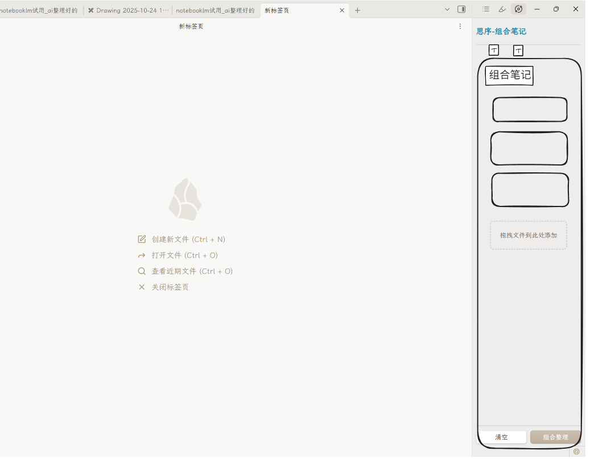

# 思序 (Notebook LLM)

面向 Obsidian 的智能学习工作流插件：将“AI 笔记整理 + 组合汇总 + Quiz 测验 + 闪卡复习 + 学习路径与画像”整合为一体，统一任务队列与多模型接入，帮助你把零散资料沉淀为体系化知识。

详细教程文档: 

https://uqdcpiio07.feishu.cn/wiki/TMdiwuknCiCSafk0DAgc5Ir6nqf?from=from_copylink

问题反馈链接:
https://uqdcpiio07.feishu.cn/share/base/form/shrcnNxR4XnLHCteXPFfdxvKlpb?iframeFrom=docx&ccm_open=iframe

用户交流QQ群: 1043587681



## 功能特性

- AI 笔记整理：解析 Markdown/YAML、图片与外链，基于可切换的提示词模板输出结构化文章；保留 YAML、标签与代码块；支持文件名模板与输出位置。
- 组合笔记工作台：侧边视图管理待整理列表，拖拽排序、检索/筛选；一键合并多篇笔记，自动汇总标签并生成“组合笔记_YYYY-MM-DD.md”。
- Quiz 生成与评分：从笔记生成单选/多选/填空/简答题，内置考试界面与 AI 自动评分，结果落盘到独立目录。
- 智能闪卡系统：从笔记快速生成卡组；支持简化 FSRS 与 SM-2 调度、学习统计与进度卡片；移动端交互友好。
- 学习中心与画像：学习路径生成与任务队列、活动流与热力图、个人资料页聚合复习统计与成就。
- 多模型接入：内置智谱/OpenAI/DeepSeek/Gemini 与自定义服务；文本与视觉模型分离配置；支持 Base URL 覆盖与模型推荐列表。
- 任务与调试：统一任务队列与状态栏进度，失败可重试；一键输出 Markdown 调试日志到 `sixu_debugger/`（自动掩码敏感信息）。

## 兼容性

- Obsidian ≥ 0.15.0（桌面与移动均可）
- 插件 ID：`notebook-llm`（安装目录：`.../.obsidian/plugins/notebook-llm/`）

## 安装

### 从 Release 安装
- 在 Releases 下载 `思序-vX.Y.Z.zip`（或 `main.js`、`manifest.json`、`styles.css`）。
- Obsidian → 设置 → 第三方插件 → 打开插件目录。
- 解压或复制构建产物至 `.../.obsidian/plugins/notebook-llm/`，返回启用插件。

### 开发者安装
- 克隆仓库并进入目录：`git clone <repo> && cd notebook_llm_ob_cc`
- 安装依赖：`npm install`
- 开发构建：`npm run dev`（esbuild 监听，输出 `main.js`、`styles.css`）
- 将产物软链接/复制到测试 Vault 的插件目录进行热调试
- 生产构建：`npm run build`；打包发布：`npm run build:zip`

## 快速上手

### 整理当前笔记
- 命令面板执行“整理当前笔记”（`organize-current-note`），或在文件/编辑器右键使用“AI 整理笔记”。
- 进度显示在状态栏；生成的新文件会自动打开（文件名模板默认：`{name}_AI整理`）。

### 多文档组合整理
- 在文件/编辑器右键“添加到待整理列表”，或拖入组合视图。
- 左侧功能区图标或命令“打开组合笔记侧边栏”（`open-combine-notes-view`）。
- 一键“组合整理”输出 `组合笔记_YYYY-MM-DD.md` 到配置的 `combineNotesDir`（为空则存放在库根）。

### 生成并完成 Quiz
- 学习中心内为当前笔记生成试题，内含题目导航/计时/进度条。
- 交卷后自动 AI 评分，结果写入 `resultDir`（默认 `quiz/results`）。

### 闪卡学习
- 从笔记快速生成卡组，或合并现有卡组。
- 支持 FSRS/SM-2 调度、每日新卡/复习配额与总体掌握率统计。

## 设置与配置（设置 → SiXu 设置）

### 模型与服务
- 文本模型：选择智谱/OpenAI/DeepSeek/Gemini/自定义，填写 API Key，可“获取”推荐模型；支持验证凭据。
- 视觉模型：单独选择厂商与模型；DeepSeek 不提供视觉模型。
- 服务地址：每个厂商均可覆盖 Base URL；支持一键“恢复默认”。
- 自定义服务商：直接填入 Base URL 与模型名称；部分服务由于 CORS 限制无法拉取模型列表，建议手动输入模型名。

默认 Base URL（可被覆盖）：
- Zhipu：`https://open.bigmodel.cn/api/paas/v4`
- OpenAI：`https://api.openai.com/v1`
- DeepSeek：`https://api.deepseek.com/v1`
- Gemini：`https://generativelanguage.googleapis.com/v1beta`

推荐模型示例（可切换）：
- 文本：`glm-4.6`、`gpt-5`、`deepseek-chat`、`gemini-2.5-pro` 等
- 视觉：`glm-4.5v`、`gpt-4o`、`gemini-2.5-pro` 等

### 输出与并发
- 文件名模板：`outputFileNameTemplate`，默认 `{name}_AI整理`
- 输出位置：`noteOutputMode=source|custom`；`noteOutputPath` 指定自定义目录
- 组合输出：`combineNotesDir` 指定组合文件目录（空表示库根）
- 并发：`concurrency` 控制任务并发度（默认 5）

### 提示词模板
- 内置模板：通用整理（default）、公众号、技术文档、学术论文、提炼总结
- 可在设置中添加自定义模板，选择默认模板后用于整理与组合流程

### Quiz/闪卡目录（默认）
- `quizDir`: `quiz`
- `resultDir`: `quiz/results`
- `flashcard.deckDir`: `flashcards`
- `flashcard.newCardsPerDay`: 20，`flashcard.reviewCardsPerDay`: 200

### 调试日志
- 开启“调试模式”后，自动在 `sixu_debugger/` 写入一次性 Markdown 调试文件（掩码 API Key、data URL 等敏感字段）

## 目录结构

```text
src/
├─ main.ts               # 插件入口、命令注册、任务调度
├─ settings.ts           # 设置面板与配置持久化
├─ api/                  # 统一的 OpenAI 兼容 Provider 封装
├─ parsers/              # Markdown 解析与素材提取
├─ processors/           # 文本/图片/链接/Quiz 处理与生成
├─ flashcard/            # FSRS/SM-2、存储、视图与生成器
├─ learningPath/         # 学习路径生成、存储与任务队列
├─ components/           # UI 组件（进度卡片、模态框、画像）
├─ views/                # 组合视图与学习中心
├─ prompts/              # 内置/自定义提示词模板
├─ utils/                # 调试日志、拆分、统计、文件等工具
└─ types/                # 严格类型约束
```

根目录：`main.js`、`manifest.json`、`styles.css` 为发布产物；`esbuild.config.mjs`、`build-script.mjs`、`scripts/` 用于打包。

## 脚本

- `npm run dev`：开发模式（监听 TypeScript 并增量打包）
- `npm run build`：严格类型检查（`tsc -noEmit`）后生产打包
- `npm run build:zip`：在 `release/` 生成可分发 ZIP
- `npm run package`：在 `release/` 复制产物（不重复类型检查）
- `npm run version`：版本号与 `manifest.json`/`versions.json` 同步

## 故障排查

- 任务停滞：降低 `concurrency`，查看状态栏与 `sixu_debugger/run_*.md`
- API 失败：检查 API Key/模型名/Base URL 是否匹配；可“恢复默认”URL
- 模型列表无法获取：自定义服务商常见 CORS 限制，手动输入模型名即可
- 图片/外链：本地图片自动转 data:URL，外链需可访问；必要时在正文中手工修正
- 覆盖冲突：如文件已存在会弹出确认；取消后自动递增 `_2/_3...`

## 开发者指南

- TypeScript 严格模式；统一 Tabs + 单引号；遵循单一职责与复用既有抽象
- 新增能力优先复用 `processors/`、`api/`、`utils/`；避免重复实现
- 构建需通过 `npm run build`；修改版本同时更新 `manifest.json` 与 `versions.json`
- 插件 ID、命令 ID 与视图类型使用 kebab-case（如 `open-combine-notes-view`）

## 安全与隐私

- API Key 保存在 Obsidian 设置中，插件不会写入仓库或产物
- 调试日志自动掩码授权头、`sk-` 密钥与图片数据 URL

